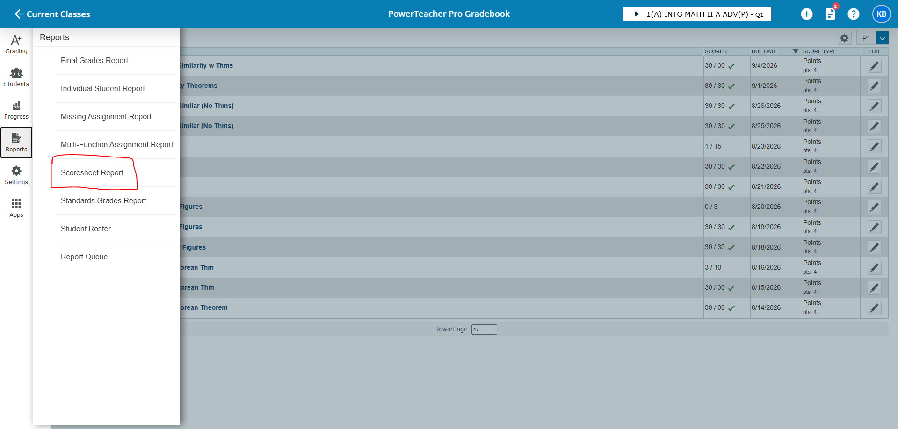
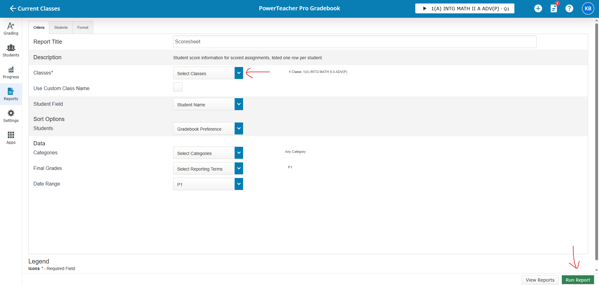
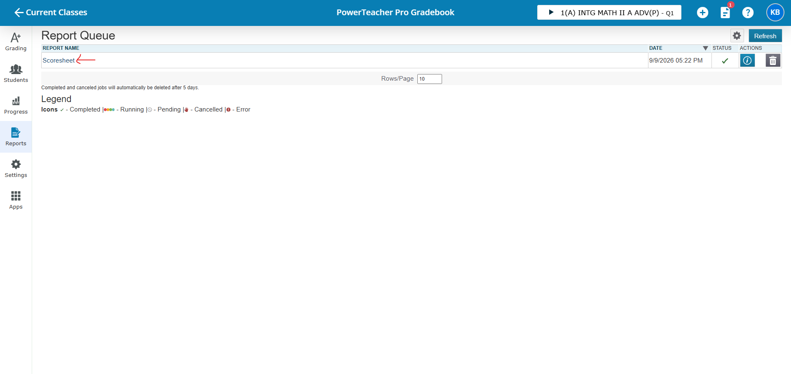
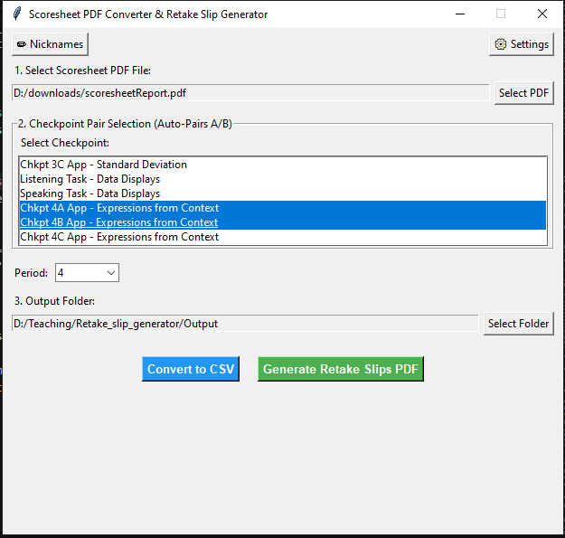
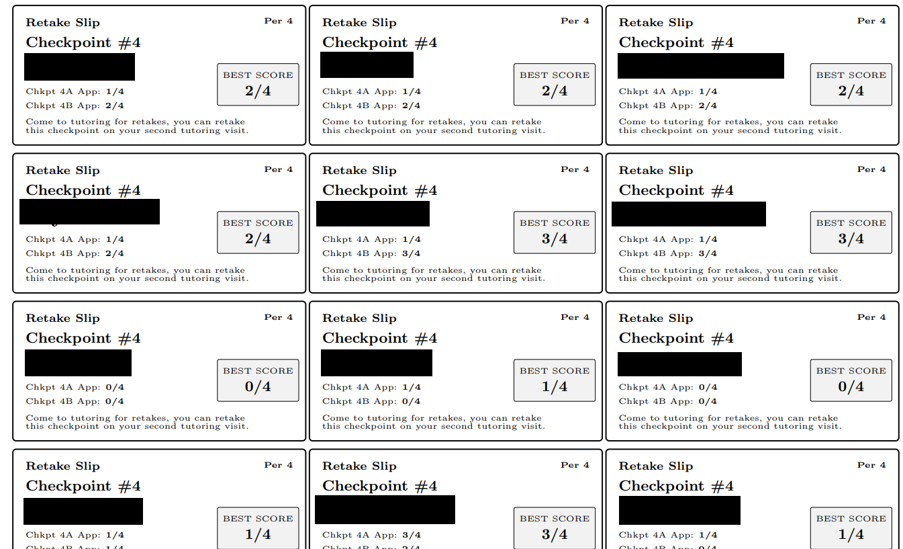

# Retake Slip Generator & PowerSchool Scoresheet Converter

A desktop utility for teachers to process PowerSchool Scoresheet PDFs into CSV spreadsheets and automatically compile printable $3 \times 8$ grid retake slips for students.

---

## 📥 How to Download and Run

1. Navigate to the **Releases** section on the right side of this GitHub repository page.
2. Download the latest release ZIP file (`Retake_Slip_Generator_v1.0.0.zip`).
3. Extract the contents of the ZIP file to a folder on your computer.
4. Double-click **`Retake_Slip_Generator.exe`** to launch the program (no Python installation required).

> **Note:** Ensure `config.json` and `preferred_names.json` remain in the same folder as `Retake_Slip_Generator.exe`.

---

## 📌 Exporting the Scoresheet Report from PowerSchool

1. Log into **PowerSchool** and navigate to **PowerTeacher Pro**.
2. In the left navigation menu, click **Reports** and select **Scoresheet Report**.

3. Configure the report settings:
   - Select the classes you wish to export. The application will combine students across sections and sort them alphabetically.
   - Ensure student assignment scores are included.
   - Set the output format to **PDF**.

4. Click **Run Report**. Once generation completes, click the blue report name link to download the PDF to your computer.

---

## 🚀 How to Use the Application

1. **Select Scoresheet PDF**: Click **Select PDF** to open your downloaded PowerSchool PDF report.
2. **Select Checkpoint Pair**: Click on a checkpoint (e.g., *Checkpoint 1A*). The application will automatically highlight and pair its corresponding assignment (*Checkpoint 1B*).

3. **Configure Name Format & Settings**:
   - Open **⚙ Settings** to choose your preferred default student name format (*First + Last Initial*, *First + Last*, or *First Name Only*).
   - Use **✏ Preferred Names** to override individual student names (e.g., nicknames or preferred first names).
4. **Generate Outputs**:
   - Click **Convert to CSV** to export student grade data into a structured `.csv` spreadsheet.
   - Click **Generate Retake Slips PDF** to compile your printable slips. Students who have already achieved a $4.0/4.0$ on the checkpoint pair are omitted automatically.

---

## 📄 Output Sample

The generated PDF outputs a $3 \times 8$ grid per page containing student scores and retake instructions:

